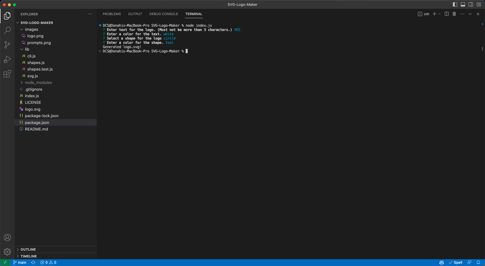

# SVG-Logo-Maker

## Table of Contents
1. [Description](#description)
2. [Installation](#installation)
3. [Technologies](#technologies) 
4. [Usage](#usage)
5. [Images](#images)
6. [Contributing](#contributing)
7. [Collaborators](#collaborators)
8. [Tests](#tests)
9. [Questions](#questions)
10. [License](#license)
11. [Video Walkthrough](#video-walkthrough)

## Description
This is a command-line tool that allows the user to create custom logos by combining text and geometric shapes. The user can choose up to three characters of text, a text color and shape type, and the tool will generate an SVG logo.

## Installation
To install the SVG Logo Maker, follow these steps:
 1. Clone the GitHub repository: `git clone https://github.com/Augustus1110/SVG-Logo-Maker.git`
 2. Navigate to the project's directory: `cd SVG-Logo-Maker`
 3. Install the required npm packages: `npm install`

## Technologies
This project was built using the following technologies:
    - Node.js
    - Inquirer.js
    - Jest

## Usage
To use the SVG Logo Maker, follow these steps:
 1. Ensure you are in the project's root directory.
 2. Open a terminal and run the following command: `node index.js`
 3. Answer the prompted questions about your shape.
 4. Once you have answered all the questions, the SVG logo will be generated in the current directory.

## Images

## Contributing
Contributions to the SVG Logo Maker are welcome. To contribute, please follow these guidelines:
 1. Fork the repository.
 2. Create a new branch.
 3. Make your changes and commit them.
 4. Push your changes to your forked repository.
 5. Submit a pull request detailing your changes.

## Collaborators
This project was completed with guidance and assistance from UC Berkeley Extension tutor, Robby Kurle.

## Tests
This project includes automated tests to ensure the correctness of the SVG shape rendering. You can run the tests using the following command: `npm run test`

## Questions
If you have any questions, please contact me:

- GitHub: [Augustus1110](https://github.com/Augustus1110)
- Email: donahi22@gmail.com

## License
MIT
(https://opensource.org/licenses/MIT)

## Video Walkthrough
(https://drive.google.com/file/d/1EXi_ys6b-jvQWAyDTgSJrrkCvi8eMecI/view)
